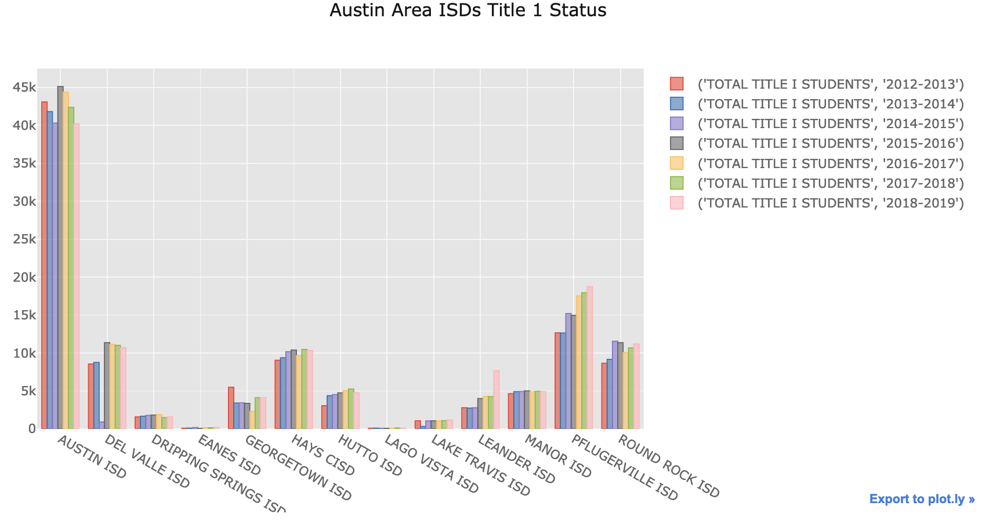
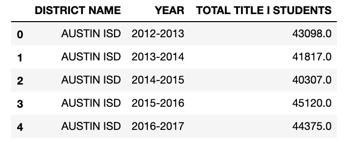
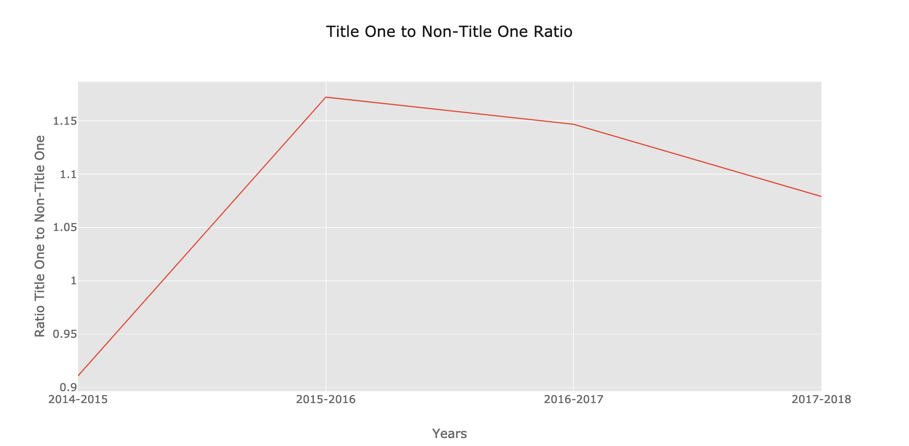
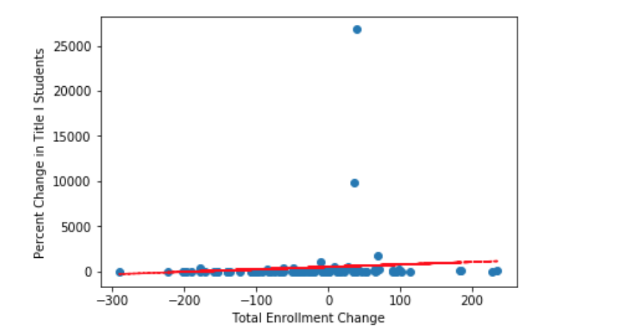
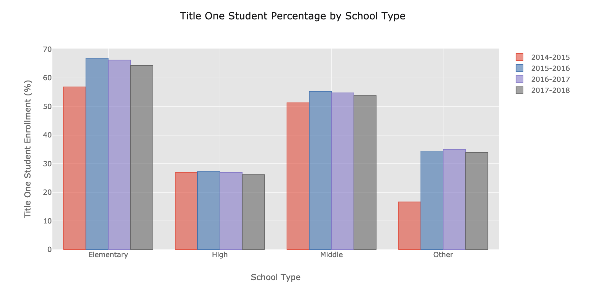
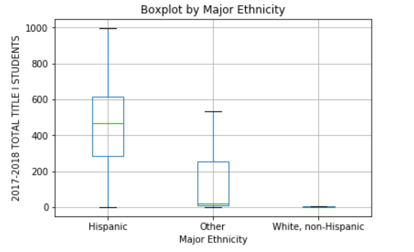

# Title I Enrollment Across Austin ISD

## Did you know that Austin ISD schools have been shrinking?

It's true, see for yourself:

Format: 

Austin has been on a steady decline the past few years, a pattern that may not stop showing up according to a [local news source](https://www.statesman.com/news/20190107/aisd-enrollment-projected-to-drop-by-7200-students-by-2028).

Alongside this phenomenon, it can also be observed that __the number of Title I students in Austin has increased__. That's right, the number of enrolled students whose family's income sits below the federal poverty line (and that have signed up for Title I Programs) has gone up.

Format: 

Format: 

Austin ISD has experienced a steadier and more sporadic change in this regard, however, the result is still the same. While other districts experience a sharper increase, our team chose to examine just one district to keep the project concise.

## Hypothesis

Originally, the team thought that if total enrollment across Austin ISD decreases then Title I enrollment must increase, but after brief research we saw that that was not necessarily the case. In the chart "Title I Students in Austin ISD" above, we observe that the raw number of Title I students in the most recent school year is not greater than the raw number of Title I students in the most distant school year.

We then decided to pivot to proportions. Could the proportion of Title I students to total students increase over this period?

Format: 

It could work! Thus, we settled on our hypothesis. __If total enrollment across Austin ISD decreases then the proportion of Title I students to total students will increase__.

## Tests and Conclusions

Context is very important in this case. How would this inverse relationship even come about, or why would it? We considered the situation where a young, freshly graduated tech professional moves to Austin to start a new job. While settling in, the young professional moves into an apartment a family just moved out of. With the help of the above charts it's fair to asssume that this family moves to a different school district, thereby explaining the decrease in enrollment in Austin ISD. But, that's where our research falls a bit short.

Format: 

What we wanted and expected to see was a negative trend, where the Percent Change of Title I Students on the y-axis decreased as the Total Enrollment Change on the x-axis increased. The trend line should start toward the uppter left and continue downward from there but instead lies mostly flat while trending upward towards the greater changes in total enrollment. Predictably, the linear regression yield supremely insignificant results.

Format: 

Not only is the p-value absurdly large, the r-value (or r-squared if squared) tells us that this dependent variable can only account for a negligible portion of the change in our independent variable. __Change in total enrollment does not indicate a change in proportion of Title I students__.

## Future Research

There are a number of reasons our hypothesis could have failed, the most prominent listed below.

1. Type of School

    
    Format: 

    Having the three school types (Elementary, Middle, and High) combined can potentially hurt the relationships we're looking for. Consider that the percentage of these students being much lower in High Schools due to dropping out and it will be obvious as to why a relationship may not exist in high schools, in general. It would be interesting to conduct these tests in a multivariate linear regression, where school type is a dummy variable and carries its own coefficient.

2. Schools by Major Ethnicity

    
    Format: 

    The boxplot above shows that a difference in the mean of Total Title I Students in the 2017-2018 school year is expected when the major ethnicity of schools is taken into account. That is, if a school has a Hispanic population of greater than 50%, then they can be classified as a Hispanic school. The same methods were applied to the other listed ethnicities. Unfortunately, due to the lack of data available it wasn't possible to further use these statistics. Again, what could be done with complete data is a multivariate linear regression with 'Major Ethnicity' as a dummy variable that carries its own coefficient.

Education data is very complicated, in fact education policy regressions usually have more or less 10 dependent variables, together accounting for an r-squared of 90% or so. To expect anything remotely close to that is extreme, but to strive to observe a low p-value is not absurd.

Consider the contextual story given earlier. Maybe the family moving out of that apartment had kids who were enrolled as Title I students. In that case, the total enrollment and the Title I enrollment of that school would decrease by the same amount, thereby leaving the propotion of Title I students to total enrollment unchanged. Thanks for reading!